# CLAUDE - Elite Code Standards & Audit Report
**Alexander's Cleaning Service - Next.js 16 + React 19**
**Audit Date:** January 13, 2026
**Overall Score:** 8/10 Production-Ready

---

## SEVERITY LABELS & RESPONSE TIMES

```
[CRITICAL] ⚠️  STOP - Fix immediately, blocks production
[HIGH]     🔴  Fix before next deployment
[WARNING]  🟡  Fix soon, impacts quality/security
[MEDIUM]   🟠  Plan to fix in next sprint
[LOW]      🟢  Optimize when time permits
[PASS]     ✅  No action needed
```

---

## CRITICAL ISSUES REQUIRING IMMEDIATE ACTION

### 🔴 ISSUE #1: Web3Forms API Key Hardcoded
```
SEVERITY: [CRITICAL]
FILE: lib/lead-notification.ts:15, 98
DISCOVERED: During security audit
STATUS: 🚨 UNFIXED

┌─ CURRENT STATE ─────────────────────────────────────────┐
│ access_key: 'ab814df1-2bbb-4df6-ab0c-5acf8c34f6c4'     │
│ (exposed in source code, visible in network tab)        │
└─────────────────────────────────────────────────────────┘

RISK ASSESSMENT:
- ❌ Anyone can see key in git history
- ❌ Visible in browser network tab
- ❌ Can be used to spam your Web3Forms quota
- ⚠️  Account takeover if key has elevated permissions

REQUIRED FIX:
1. Add to .env.local: NEXT_PUBLIC_WEB3FORMS_KEY=ab814df1-2bbb-4df6-ab0c-5acf8c34f6c4
2. Update lib/lead-notification.ts: access_key: process.env.NEXT_PUBLIC_WEB3FORMS_KEY
3. Regenerate Web3Forms access key immediately
4. Add to .env.example (with placeholder)
5. Deploy to Vercel with new environment variable
```

### 🔴 ISSUE #2: Email HTML Injection Risk
```
SEVERITY: [HIGH]
FILE: lib/email.ts:69-87
DISCOVERED: During input validation audit
STATUS: 🚨 UNFIXED

VULNERABLE CODE:
lib/email.ts line 82:
  <div class="value">${data.message}</div>

If user submits: 
It executes in email viewer

REQUIRED FIX:
Create escapeHtml utility:
  function escapeHtml(text: string): string {
    const map: { [key: string]: string } = {
      '&': '&amp;',
      '<': '&lt;',
      '>': '&gt;',
      '"': '&quot;',
      "'": '&#039;'
    };
    return text.replace(/[&<>"']/g, (m) => map[m]);
  }

Update all user data in templates:
  OLD: <div class="value">${data.message}</div>
  NEW: <div class="value">${escapeHtml(data.message)}</div>
```

### 🟡 ISSUE #3: Race Condition in Quote Submission (THE HICCUP!)
```
SEVERITY: [HIGH] - This is the bug you found!
FILE: app/components/calculator/PricingCalculator.tsx:145-173
DISCOVERED: During data flow audit
STATUS: 🚨 UNFIXED - REQUIRES REDESIGN

THE BUG FLOW:
Step 1: User enters name, phone, clicks "GENERATE ESTIMATE"
Step 2: triggerProcessing() called
Step 3: notifyNewLead() fires IMMEDIATELY ← BUG!
Step 4: Processing animation plays (3 seconds)
Step 5: AI insight generates
Step 6: User clicks "LET'S DO THIS"
Step 7: Quote submitted to API

PROBLEM:
- Lead notification sent with INCOMPLETE data
- No validation before notification
- If user closes tab during processing = orphaned lead + no quote
- If AI fails = notification sent but quote marked as submitted
- Violates "validate THEN notify" principle

LOGIC DIAGRAM:
┌─────────────┐
│  User Input │
└──────┬──────┘
       │
       ├─→ [notifyNewLead] ← FIRES TOO EARLY!
       │
       ├─→ [generateInsights]
       │
       └─→ [showResults]
           └─→ [User selects package]
               └─→ [notifyPackageSelected] ← CORRECT ORDER
                   └─→ [submitQuote]

CORRECT FLOW SHOULD BE:
┌─────────────┐
│  User Input │
└──────┬──────┘
       │
       ├─→ [validateData] ← FIRST
       │
       ├─→ [notifyNewLead] ← AFTER VALIDATION
       │
       ├─→ [generateInsights]
       │
       ├─→ [showResults]
       │
       └─→ [handleQuoteSubmit]
           ├─→ [validateAgain]
           ├─→ [submitToAPI]
           └─→ [notifyPackageSelected]

TEST CASES TO VERIFY FIX:
1. User closes browser during processing
   EXPECTED: Lead notification sent, quote NOT saved
   ACTUAL: Both sent? Or neither? ← Need to test!

2. AI insight fails during generation
   EXPECTED: Error shown, quote submission blocked
   ACTUAL: Does quote still show? ← Need to test!

3. User refreshes page on Step 4
   EXPECTED: Data lost, no duplicate notification
   ACTUAL: State reset or persisted? ← Need to test!

REQUIRED FIX:
Restructure triggerProcessing() flow:
  async function triggerProcessing() {
    // Step 1: Validate
    const validationResult = validateData(data);
    if (!validationResult.success) {
      setSubmitError(validationResult.error);
      return;
    }

    // Step 2: Notify (only after validation succeeds)
    await notifyNewLead({
      name: data.name,
      phone: data.phone,
      zipCode: data.zipCode,
      homeSize: data.homeSize
    }).catch(err => {
      console.warn('Lead notification failed:', err);
      // Don't fail user experience, continue
    });

    // Step 3: Generate insights
    setIsProcessing(true);
    // ... rest of processing
  }
```

---

## MERMAID LOGIC DIAGRAMS

### Current Data Flow (WITH BUG)


### Fixed Data Flow (CORRECT)

```mermaid
graph TD
    A["User Inputs Name/Phone/ZIP"] -->|Step 1| B["User Clicks NEXT"]
    B -->|Click Handler| C["triggerProcessing()"]
    C -->|Validate Data| D{Valid?}
    D -->|NO| E["Show Error"]
    E -->|Fix & Retry| C
    D -->|YES| F["notifyNewLead() ✅ AFTER VALIDATION"]
    F -->|Fire in Background| G["Start Processing Animation"]
    G -->|3 seconds later| H["generateDynamicInsights()"]
    H -->|Success| I["Display Results"]
    I -->|User Clicks LET'S DO THIS| J["notifyPackageSelected()"]
    J -->|Open Modal| K["Contact Modal"]
    K -->|User Calls/Texts| L["CONVERSION"]

    style F fill:#99ff99
    style C fill:#ccffcc
```


---

## SECURITY FINDINGS SUMMARY

| Issue | Severity | Status | Action |
|-------|----------|--------|--------|
| Web3Forms key hardcoded | CRITICAL | 🚨 UNFIXED | Move to env var, rotate key |
| Email HTML injection | HIGH | 🚨 UNFIXED | Add HTML escaping |
| Environment vars in .env.local | CRITICAL | ✅ PROTECTED | Already in .gitignore |
| Supabase keys | CRITICAL | ✅ SERVER-SIDE ONLY | No exposure risk |
| CSRF protection | MEDIUM | ✅ IMPLEMENTED | Working correctly |
| Rate limiting | MEDIUM | ✅ IMPLEMENTED | Works for single server |
| Input validation | MEDIUM | ⚠️ ACCEPTABLE | Phone regex could be stricter |

---

## PERFORMANCE FINDINGS SUMMARY

| Issue | Severity | Impact | Status |
|-------|----------|--------|--------|
| Multiple scroll listeners | WARNING | Jank on scroll | 🚨 UNFIXED |
| CLS - Layout shift | WARNING | Visual janky | 🚨 UNFIXED |
| Fake progress bar | LOW | UX issue | 🚨 UNFIXED |
| Missing useCallback | OPTIMIZATION | Re-renders | 🟡 OPTIONAL |
| Missing useMemo | OPTIMIZATION | Recalculations | 🟡 OPTIONAL |
| Component size (689 lines) | OPTIMIZATION | Maintainability | 🟡 OPTIONAL |

---

## MANDATORY TEST CASES FOR CRITICAL FIXES

### Test Suite: Race Condition Fix (Issue #3)
```typescript
describe('Quote Submission Race Condition', () => {

  test('Lead notification does NOT send if validation fails', async () => {
    // WHEN user submits with empty name
    const { rerender } = render(<PricingCalculator />);
    fireEvent.change(screen.getByPlaceholderText('Your name'), { target: { value: '' } });
    fireEvent.change(screen.getByPlaceholderText('(570)'), { target: { value: '5706149575' } });
    fireEvent.click(screen.getByText('GENERATE ESTIMATE'));

    // THEN notifyNewLead should NOT have been called
    expect(notifyNewLead).not.toHaveBeenCalled();

    // AND error message should display
    expect(screen.getByText(/name.*required/i)).toBeInTheDocument();
  });

  test('Lead notification sends AFTER validation succeeds', async () => {
    // WHEN user submits with valid data
    fireEvent.change(zipInput, { target: { value: '18411' } });
    fireEvent.change(nameInput, { target: { value: 'John Doe' } });
    fireEvent.change(phoneInput, { target: { value: '5706149575' } });
    fireEvent.click(screen.getByText('CONTINUE'));

    // THEN notifyNewLead should be called with correct data
    await waitFor(() => {
      expect(notifyNewLead).toHaveBeenCalledWith({
        name: 'John Doe',
        phone: '5706149575',
        zipCode: '18411',
        homeSize: expect.any(String)
      });
    });
  });

  test('Closing tab during processing does NOT save quote', async () => {
    // WHEN user closes tab during 3-second processing
    fireEvent.click(screen.getByText('GENERATE ESTIMATE'));

    // THEN quote should be in "processing" state
    expect(screen.getByText('ANALYZING')).toBeInTheDocument();

    // WHEN page unloads
    window.dispatchEvent(new Event('beforeunload'));

    // THEN quote endpoint should NOT be called yet
    expect(fetchMock).not.toHaveBeenCalledWith(expect.stringContaining('/api/quote'));
  });

  test('AI insight failure does NOT prevent error handling', async () => {
    // WHEN AI service fails
    mockGenerateInsights.mockRejectedValue(new Error('AI service down'));

    fireEvent.click(screen.getByText('GENERATE ESTIMATE'));

    await waitFor(() => {
      // THEN error should be displayed
      expect(screen.getByText(/error.*generating/i)).toBeInTheDocument();
    });

    // AND quote form should be reset
    expect(screen.queryByText('Your Estimate')).not.toBeInTheDocument();
  });
});
```

### Test Suite: Email HTML Injection Fix
```typescript
describe('Email HTML Escaping', () => {

  test('HTML entities in message are escaped', () => {
    const xssPayload = '';
    const escaped = escapeHtml(xssPayload);

    expect(escaped).toBe('&lt;img src=x onerror=&quot;alert(&#039;XSS&#039;)&quot;&gt;');
    expect(escaped).not.toContain(' {
    const quoteForm = render(<QuoteForm />);

    fireEvent.change(screen.getByPlaceholderText('Message'), {
      target: { value: '"><script>alert("XSS")</script>' }
    });
    fireEvent.click(screen.getByText('Submit'));

    await waitFor(() => {
      // Email content should be safely escaped
      const emailCall = sendQuoteNotification.mock.calls[0][0];
      expect(emailCall.message).not.toContain('<script>');
      expect(emailCall.message).toContain('&lt;script&gt;');
    });
  });
});
```

---

## ARCHITECTURE HEALTH CHECK

```
Component Structure:       ✅ GOOD (clean separation)
Type Safety:             ⚠️  MEDIUM (too many 'as any')
Error Handling:          ✅ GOOD (try/catch everywhere)
Data Validation:         ✅ GOOD (Zod schemas)
Security:               🔴 CRITICAL (hardcoded key)
Performance:            ⚠️  MEDIUM (optimization opportunities)
Testing:                ⚠️  LIMITED (no tests found)
Documentation:          ⚠️  MINIMAL (add JSDoc comments)
Code Quality:           7/10
Production Readiness:   7/10 (after critical fixes = 9/10)
```

---

## QUICK FIX CHECKLIST

Priority order for fixes:

- [ ] **URGENT** Move Web3Forms key to environment variable
- [ ] **URGENT** Add HTML escaping in email.ts
- [ ] **URGENT** Verify all secrets in Vercel environment variables
- [ ] **HIGH** Fix race condition in triggerProcessing()
- [ ] **HIGH** Implement data validation before notification
- [ ] **MEDIUM** Consolidate scroll event listeners
- [ ] **MEDIUM** Fix CLS with fixed dimensions
- [ ] **MEDIUM** Add error recovery test cases
- [ ] **LOW** Split PricingCalculator into smaller components
- [ ] **LOW** Add useCallback/useMemo optimizations
- [ ] **LOW** Add data retention/deletion policies

---

## NOTES FOR FUTURE AUDITS

- Re-test after critical fixes are applied
- Add automated security scanning (npm audit, SonarQube)
- Implement E2E tests for quote submission flow
- Add performance monitoring (Lighthouse CI)
- Monitor Web3Forms quota after key rotation
- Track email delivery vs bounce rates

---

**Generated by CLAUDE Audit System**
**Next Review Date:** 30 days post-deployment
